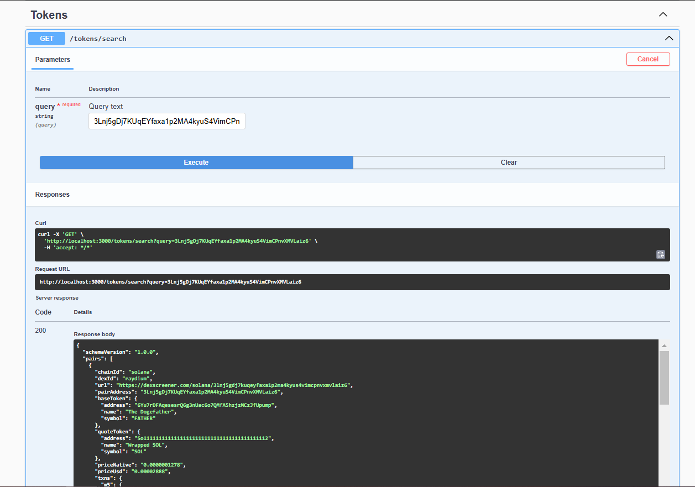

# Token Search Backend

### Description

This application provides an API for searching trading tokens by their address, trading pair, or name.
The data is retrieved through integration with the Dexscreener API, and the results are cached in Redis for improved performance.

### Technologies

- **NodeJS** + **TypeScript**
- **NestJS**
- **Redis**
- **Docker** + **Docker Compose**

---

## Project setup

### Locally

1. Make sure you have **Node.js** (>= 20) and **yarn** installed.
2. Install dependencies:

```bash
$ yarn install
```

3. Create a .env file based on .env.example and specify your settings.
4. Start Redis (you can do this via Docker):

```bash
$ docker run --name search-bar-redis -p 6379:6379 -d redis:7.0
```

5. Run the application:

```bash
$ yarn start:dev
```

### Via Docker

1. Make sure you have Docker and Docker Compose installed.
2. Create a .env file based on .env.example and specify your settings.
3. Run the containers:

```bash
$ docker-compose -f docker-compose.yaml up -d --build
```

The API(Swagger) will be available at: http://localhost:3000/api/docs.

## Compile and run the project

```bash
# development
$ yarn run start

# watch mode
$ yarn run start:dev

# production mode
$ yarn run start:prod
```

## Run tests

```bash
# unit tests
$ yarn run test

## Example of requests



## Metrics

TODO (OpenTelemetry)

## TODO

1. Implement additional metrics.
2. Improve error handling.
3. Add support for other APIs besides Dexscreener.
4. Implement additional tests.
```
